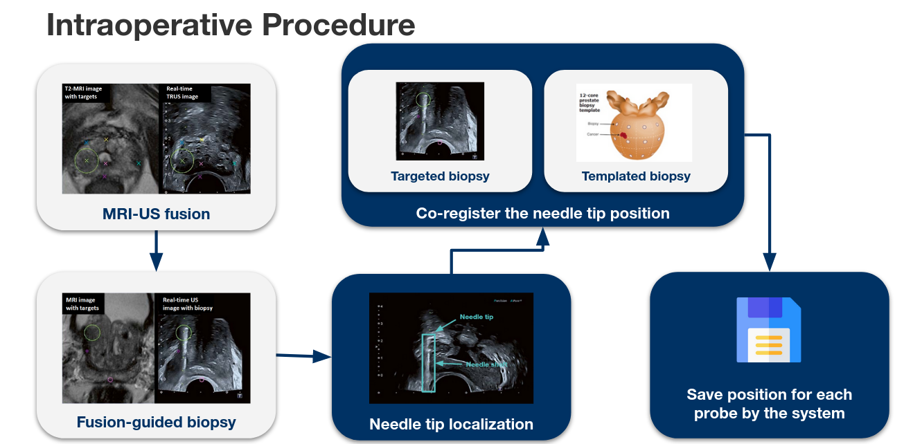

# Acoustic-Based Target Frame Detection

_Master-Praktikum - Computational Surgineering, Winter Semester 2022/23, Technical University of Munich_ 

_Target Frame Detection_ project was first drafted by Sabrina Misatian, Vivian Sutedjo, and Viktoria Markova in the scope of the "Image Guided Surgery" course offered by the CAMP chair in the winter semester of 2020/21. It was continued with an interdisciplinary project (IDP) by Viktoria Markova and Erekle Shishniashvili in the summer semester of 2021. The project scope was constrained to offline acoustic-based target frame detection. _Needle Tip Localization_ was proposed as future work in the previous IDP. In this project, I worked with Marta Gomar Chulián and Zichen Zhang. We implemented online acoustic-based target frame detection based on their ideas and continued to the needle tip localization task with the guidance of Yuan Bi, who is our project tutor. My contribution is in the online acoustic-based target frame detection part, hence you can see only that part in this GitHub repo. 

The aim of _Needle Tip Localization_ project is to find the needle tip coordinates when the prostate biopsy is taken. During the surgery, an assistant is marking the needle tips on the US screen by waiting for the biopsy shots, and he/she does not have any other job to do. If we could mark the needle tips automatically, there would not be any need for an additional assistant in the OR. Our proposed solution is to save the needle tip coordinates on the US images by image processing. Our motivation is to have fewer people in the OR and avoid human errors. According to Dr. Matthias Jahnen, it takes 50-60 surgeries to get enough experience for an urologist. During training, we believe that acquiring the needle tip positions will be important for new doctors to check whether they could hit the targeted prostate regions or not.   

Our project has two main parts: acoustic-based target frame detection and needle tip localization. 

**Acoustic-based target frame detection:** We know that each time the biopsy is taken, the biopsy shot produces a distinct, recognizable sound similar to an impulse sound. Target frames are the frames that are captured when that sound was detected. Here, the synchronization of audio and image frames is necessary to select the correct target frames. Synchronization is implemented by using [ROS](https://www.ros.org/) to have a global computer clock for audio and frame capture. Furthermore, it is possible to capture multiple sensor signals in parallel by ROS. 

**Needle tip localization:** We propose three major components:
classification, segmentation, and localization. After the target frame detection
part, images have been saved. However, some of them do not contain needles, which
are of less importance, and do not need to be performed needle tip localization.
Therefore, we use a dual classifier to classify the images whether they contain
needles or not. After classification, images containing needles are preserved,
then we apply our segmentation model to them to segment the needles to retrieve
the needle tip position in height coordinate. In the localization part, further
post-processing methods are applied to obtain the predicted 2D needle tip position.

# OR visits  

At the beginning of the project, we had two OR visits at the Department of Urology in Klinikum rechts der Isar der TUM. We met with Dr. Jahnen as a group, observed the prostate biopsy surgery procedure, asked our questions, and asked for video recordings during the surgery. He said they are using [Canon Medical’s MRI/US fusion-guided biopsy set-up](https://at.medical.canon/wp-content/uploads/sites/18/2020/11/DC_Clinical-value-of-multi-parametric-ultrasound-and-MRI-US-fusion-guided-biopsy-for-prostate-cancer-detection-and-visualization.pdf) right now, and it was possible to record videos from the US device. We got our biopsy videos from the dates of 23.11.2022 and 01.12.2022 when we had our OR visits. 

During our visits, Dr. Jahnen said that he did not need to see the computed needle tip on the screen, since he knows where the needle will reach to by experience. Shooting the targeted region is not a hard job for an experienced doctor. However, he said this information was needed for documentation purposes. Moreover, it can be used for training new doctors later. 

## Clinical Workflow 

In the pre-operative procedure, MRI images are loaded into the US device.
Regions of interest (ROI) are marked manually by the doctor. At the beginning of the 
surgery, 3D-US volume is created by sweeping the transrectal ultrasound
(TRUS). This 3D-US volume is needed for documentation purposes. Then, MRI
and TRUS images are registered automatically by the US device. 

<p align="center">
    
</p>

MRI and US images are fused to see the ROIs in the TRUS images. Fusion-guided biopsies are taken from the patient. The assistant is waiting 
for the biopsies, and then marking the needle tips for each case. The 
marked tip coordinates are saved for documentation. 
*Our project is restricted to the needle tip localization in this step.*
*You can see the corresponding steps as blue boxes in the following figure:*

<p align="center">
    
</p>

After the surgery, the doctor can see the 3D-MRI image of prostate. 
Firstly, he segments the prostate by selecting some points on the contours
of the prostate region on 2D slice images (coronal, sagital, and 
horizontal). Lastly, the biopsy positions can be seen on the 3D prostate
volume. This is a self-check for the doctor to see how successful was the prostate biopsy surgery.
This can also be given to the patient as a report. 
 
<p align="center">
    
</p>
 
# Data 

When we started the project, we had surgery videos and their audio files from the previous IDP. Available audio files were recorded by a smart phone, Xiaomi Redmi 9, approximately 3 meters away from the patient. Their quality was good enough to hear the biopsy shots. We could not take any audio recording in the OR visits due to data privacy issues, therefore we used the old audio files in our demo by editing the biopsy videos. 

Old videos had image resolution of 950x540, which was not high enough for image processing. For this reason, we created a new dataset with image resolution of 1280x960. Temporal resolution was 30 frames per second (fps) for both cases. 

## Data Preparation

DICOM files per each surgery were exported from the US device. DICOM files were converted to videos as AVI format. The exported videos were not non-stop videos and some of them did not have biopsy shots. Firstly, we discarded the videos having no biopsy shot, and then cropped the videos such that each video has exactly one biopsy shot. Here, you can see the available label folders from two days. 

    labels
    └──20221125    # day 1 
        ├──120656         # surgery 1 
        ├──120847         # surgery 2
        ├──122004         # surgery 3
        └──122105         # surgery 4
    └──20221201    # day 2
        └──125708         # surgery 1 

No assistance was provided for labeling the needles on TRUS images, therefore we had to label the frames using a medical image software program. [ImFusion Suite](https://www.imfusion.com/products/imfusion-suite) program was used to create needle segmentation labels. For each biopsy shot, biopsy needle was present in around 15-20 frames. 


# Methodology 

<p align="center">
    
</p> 

As you see in the big picture, image frames are received from the US device by a frame grabber, which is an analog-to-digital converter (ADC). Audio is read by a separate microphone and processed for biopsy shout sound detection. After synchronization, the US images are fed to needle tip localization models. The result is saved. Ideally, the result is sent back to the US device for documentation step, but this last step is not implemented. 

* System Requirements 
    * Python version: Python 3.7, required Python packages are listed in [requirement.txt](requirements.txt).
    * ROS:            ROS Noetic (not supported by Ubuntu 22)
    * OS:             Only Ubuntu 20.04, not supported by Windows. 
    * Frame grabber:  Magewell UB Capture HDMI Plus
    * Microphone:     Built-in microphone of computer 
    * Memory usage:   25.18 MB (except for saved shot folders)

## Acoustic-based Target Frame Detection

The computer is connected to the US device to capture frames from the US screen. Saving all of the captured frames is not memory-efficient. 30 frames are captured per second during approximately _10 minutes_, which makes 18000 frames in total. One cropped frame allocates 212 KB on the disc, so it makes 3.64 GB at the end for one surgery. More importantly, it is computationally demanding for our needle tip localization model to process all of the frames. 

As a solution, target frame detection was proposed in the previous IDP. If we take the frames which are only around the biopsy shot sound, they are going to be enough for the needle detection models and the system will be memory- and computationally-efficient. Audio and frame files are captured in parallel by using ROS. By online audio processing, the biopsy shot times are determined by the audio peak detection method, and only the frames around this peak time are saved inside some separate shot folders. 

### ROS

Before this project, any of us did not have experience with ROS before. Firstly, we followed the [ROS tutorials](http://wiki.ros.org/ROS/Tutorials) from their official website. Later, we started to work on the ROS package "frame grabber",  which was provided by our tutor.  

 

There are 3 ROS nodes in the ROS package: `frame_capture_node`, `audio_publisher_node`, and `target_frame_detection_node`. `audio_publisher_node` is a Publisher node, `target_frame_detection_node` is a Subscriber node, and they are connected to the topic `audio`. 

* Command to run the ROS package: 

```
roscore
roslaunch us_dev_screen_capture start_screen_cap.launch
```

* `frame_capture_node`: Capturing and saving the frames as PNG files with their timestamp. Timestamps are taken from the global ROS clock. The filenames are saved as "seconds_miliseconds.png" inside "Image Data" folder. 

* `audio_publisher_node`: Capturing and saving the audio files as WAV files with their timestamps inside "Audio Data" folder, and publishing the audio filenames as `String` messages to the topic `audio`. Timestamps are again taken from the global ROS clock and saved similarly. 

* `target_frame_detection_node`: Subscribing the audio filenames, which are `String` messages, from the topic `audio`. The WAV files are processed to detect whether any biopsy shot occured. If any biopsy shot was detected, the target frames are moved to another "shot" subfolder inside "Biopsy Data" folder. Old audio files and image frames are deleted. Synchronization between audio and frames are guarenteed by the timestamps of audio files and image frames. 

Audio-frame synchronization is implemented by the topic "audio". Our approach is to save the audio files and image frames from the previous 3 seconds, and delete them after target frame detection is over. In each iteration, 3 audio files exist and only the first 2 audio files are processed. We are processing only the first 2 audio files, since if we detect the peak at the end of the 2nd audio file, then it means we would need the frames around the biopsy shot time. These frames would correspond to the frames that we capture at the same time with the 3rd audio file. Therefore, we do not process the 3rd audio file, but just to keep it to have the necessary frames with the correspoding timestamp. 

Maximum biopsy shot duration is assumed to be 1 second. Each audio file is stored with the time step of 1 second. The reading of the audio files is done for the last 1.5 seconds out of the 2 seconds of the processed audio files. With this sliding winddow approach, it is ensured that the peak time will not be missed in between the starting and end times of the audio files. Besides, in case the peak is detected, the following iteration will be skipped not to detect it twice.  

<p align="center">
    
</p>

Memory usage of audio capture: 3 audio files are saved when the audio processing starts, and the 4th audio file is being saved. 1 audio file allocates 88.1 KB space on the disc, which makes 4 x 88.1 KB = 352.4 KB.

Memory usage of frame capture: 3 audio files correspond to 3 seconds for image frames, and the image frames of the 4th second are being saved. 1 image frame allocates 212 KB space in the disc, then it makes maximum 30 x 4 x 212 KB = 24.84 MB.  

Note: The possible offsets of captured frames and audio files due to hardware delays are ignored, since we did not observe any severe problem during this project. When there is any audio/frame capture offset, the start and end times of the time interval can be adjusted by this observed offset time. 

### Online Audio Detection 

[PyAudio](https://pypi.org/project/PyAudio/) library is used for online audio processing instead of [librosa](https://librosa.org/blog/2019/07/29/stream-processing/), which was used in the previous IDP, since librosa does not support online audio processing. PyAudio provides Python bindings for PortAudio, which is the cross-platform, audio I/O library. 
<!-- https://people.csail.mit.edu/hubert/pyaudio/docs/#pyaudio-documentation -->

One needs to configure the stream parameters for audio processing. 

Configuration of the stream parameters: 
* `format`: Portaudio sample format
* `channels`: channel numbers of the sound device, usually 1 or 2 
* `rate`: sampling rate, also called as frame rate, usually 44100 or 48000 
* `frames_per_buffer`: chunks sizes 
* `input`: input mode, stream can capture online audio from the current input device (microphone)
* `output` output mode, stream will be feeding to the current output device (speaker)  

#### Biopsy Sound Detection Method 

In the previous IDP, gradient method was proposed as the last decision to detect peak sounds. There are two derivative methods to use: `grad_1` and `grad_4`. It was stated that 4th derivative method was expected to perform better as literature review suggested, but in practice 1st derivative was better. We also observed the same situation, and therefore `grad_1` is used in the gradient peak detection method. The user can add also other peak detection methods to [audio_peak_detectors.py](ros_package/framegrabber/us_device_screen_capture/src/audio_peak_detectors.py). We did not focus on the development of peak detection methods, since it was out of this project's scope. 

### Online Frame Capture 

Firstly, we started to work with the frame grabber [Epiphan DVI2USB 3.0](https://www.epiphan.com/products/dvi2usb-3-0/tech-specs/). This frame grabber was taken from the US device in the CAMP Chair at the Garching campus. We encountered the problem that this frame grabber was not supported by Linux OS anymore, but only Windows. We needed to work on Ubuntu 20, since ROS Noetics did not have the OS support with Windows. Hence, we changed our frame grabber to [Magewell UB Capture HDMI Plus](https://www.magewell.com/products/usb-capture-hdmi-plus). It supports capture resolutions up to 2048 x 2160 and frame rate up to 120 fps, which satisfies our specifications with the US device. This frame grabber was taken from the IFL Lab at TUM Klinikum rechts der Isar. We went to the IFL lab each time to work with the frame grabber and to have discussion meetings with our tutor. 

OpenCV library is used to capture the US device screen by using frame grabber. Frame rate is set to 30 fps in our code, since the videos from the surgeries had also frame rate of 30 fps in DICOM files. The user needs to set the screen capture configurations from [screen_cap_config.yaml](ros_package/framegrabber/us_device_screen_capture/config/screen_cap_config.yaml). Frame resolution is set to 1920 x 1080 (width x height). The cropped frame coordinates are set so as to crop the US image by discarding the MRI image. The blank parts are also discarded from the left and right sides. Their resolution is 720 x 1080.
# Demo 

The left-side laptop is capturing frames from the right-side laptop, which is simulating 
the US device. The biopsy shot video was played on the right-side laptop and the video audio 
was amplified by the speaker next to the capture device. We used the video 
[data/videos/20221125/120847](data/videos/20221125/120847) and edited the audio 
with the previous IDP's sample audio files.  

<p align="center">
    
</p> 

There are 3 shot sounds in the demo video: 

<p align="center">
    
</p> 

The captured shot frames are saved inside "Shot" folders in this main folder: [demo/Biopsy Data](demo/Biopsy Data). 

You can find the demo video for target frame detection here: [demo/demo_target_frame_detection.mp4](demo/demo_target_frame_detection.mp4). 

