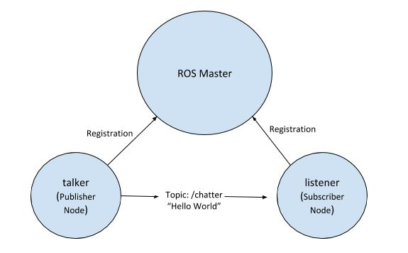

# ROS Tutorials

1. [**Installing and Configuring Your ROS Environment**](http://wiki.ros.org/ROS/Tutorials/InstallingandConfiguringROSEnvironment)
- Create a ROS workspace

```jsx
$ mkdir -p ~/catkin_ws/src
$ cd ~/catkin_ws/
$ catkin_make
```

- Inside `.bashrc` file, add one line with `source devel/setup.bash`
- Your environment is ready.

1. [**Turtlesim tutorial**](http://wiki.ros.org/ROS/Tutorials/NavigatingTheFilesystem)

```bash
rospack 
roscd
rosls 
```

1. [**Creating a ROS package**](http://wiki.ros.org/ROS/Tutorials/CreatingPackage) 

```bash
$ cd catkin_ws/src
$ catkin_create_pkg audiograbber std_msgs rospy

# This is an example, do not try to run this
# catkin_create_pkg <package_name> [depend1] [depend2] [depend3]

$ cd ~/catkin_ws
$ catkin_make

# To check your dependencies:
$ rospack depends1 beginner_tutorials
```

1. [**ROS Nodes**](http://wiki.ros.org/ROS/Tutorials/UnderstandingNodes) 
- **Nodes:** A node is an executable that uses ROS to communicate with other nodes. Two types of nodes are subscriber and publisher nodes. Make them executable before running the nodes.
- **Messages:** ROS data type which is used when subscribing or publishing to a topic.
- **Topics:** Nodes can publish messages to a topic as well as subscribe to a topic to receive messages.
- **Master:** Name service for ROS (i.e. helps nodes find each other).

```jsx
rosout: ROS equivalent of stdout/stderr
roscore: Master + rosout + parameter server 
(parameter server will be introduced later)

rospy = python client library
roscpp = c++ client library
```

- `rosrun`: allows you to use the package name to directly run a node within a package (without having to know the package path).
    
    `rosrun <pkg_name> <node_name>, e.g. rosrun audiograbber audio_publisher.py`
    
    `rosnode list`
    
    `rosnode info /rosout`
    
    `rosgraph`: creates the schematic for your nodes in communication. 
    
    `rosmsg info std_msgs/Int16` 
    
- **`roscore`** = ros+core : master (provides name service for ROS) + rosout (stdout/stderr) + parameter server (parameter server will be introduced later)
- **`rosnode`** = ros+node : ROS tool to get information about a node.
- **`rosrun`** = ros+run : runs a node from a given package.
- **`roslaunch`:** tool for easily launching multiple ROS nodes locally and remotely via SSH, as well as setting parameters on the Parameter Server. It takes in one or more XML configuration files (with the .launch extension) that specify the parameters to set and nodes to launch, as well as the machines that they should be run on.
    
    Many ROS packages come with "launch files", which you can run with:
    
    ```
    $ roslaunch package_name file.launch
    ```
    



**→ How to write publisher and subscriber?** 

```jsx
rospy.init_node('listener', anonymous=True)
-> data type should be imported as well

rospy.Subscriber("chatter", String, callback) 
 -> 1. topic name - must be identical to the publisher topic 
 -> 2. data type 
 -> 3. callback functions are like running in the background

# spin() simply keeps python from exiting until this node is stopped
rospy.spin()
```

You can also check your message types, check it later. 

1. [**ROS Topics**](http://wiki.ros.org/ROS/Tutorials/UnderstandingTopics)

`rostopic list`

`rostopic echo /frame_grabber/us_img` 

`rostopic info /frame_grabber/us_img` 

1. [**Writing a Simple Publisher and Subscriber**](http://wiki.ros.org/ROS/Tutorials/WritingPublisherSubscriber%28python%29)

Make Python scripts executable : `chmod +x talker.py` 

**Publisher**

```python
#!/usr/bin/env python
# license removed for brevity
import rospy
from std_msgs.msg import String

def talker():
    pub = rospy.Publisher('chatter', String, queue_size=10)
    rospy.init_node('talker', anonymous=True)
    rate = rospy.Rate(10) # 10hz
    while not rospy.is_shutdown():
        hello_str = "hello world %s" % rospy.get_time()
        rospy.loginfo(hello_str)
        pub.publish(hello_str)
        rate.sleep()

if __name__ == '__main__':
    try:
        talker()
    except rospy.ROSInterruptException:
        pass

# Message Data
msg = String()
msg.data = str
# or you can initialize some of the fields and leave the rest with default values:
String(data=str) 
```

**Subscriber**

```python
#!/usr/bin/env python
import rospy
from std_msgs.msg import String

def callback(data):
    rospy.loginfo(rospy.get_caller_id() + "I heard %s", data.data)
    
def listener():

    # In ROS, nodes are uniquely named. If two nodes with the same
    # name are launched, the previous one is kicked off. The
    # anonymous=True flag means that rospy will choose a unique
    # name for our 'listener' node so that multiple listeners can
    # run simultaneously.
    rospy.init_node('listener', anonymous=True)

    rospy.Subscriber("chatter", String, callback)

    # spin() simply keeps python from exiting until this node is stopped
    rospy.spin()

if __name__ == '__main__':
    listener()
```
